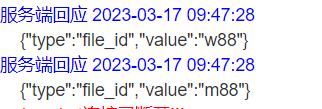

# Bri-Mapper

## 关于后端webSocket使用

1. 在使用ApiFox接口之前，首先需要发送请求，连接上WebSocket
  
  webSocket在线测试网站：http://coolaf.com/tool/chattest
  建立如图所示的连接后，会返回如下信息:
  ```
  {
  "type": "sessionId",
  "value": <UUID>
}
  ```
  需要保存sessionId的信息，后续发送请求会使用
2. 按照ApiFox中接口发送映射请求,请求中sessionId的值需要改成你刚刚连接获得的信息

   上传的文件，我这边具体类型是MultipartFile，不知道对你有没有影响
   请求成功后会收到响应：
   ```json
   {
    "code":0,
    "data":
     {
      "w88":"w88",
      "m88":"m88"
     },
     "msg":null
   }
   ```
只用关注data中的内容，其中w88是上传的映射文件1 w88.csv的名字，目前设置它的内容也是w88，故为“w88":"w88"。
  **这里并不是说映射成功了，只是请求成功了，每一个文件映射成功后的响应会由webSocket发出。(收到这个响应，前端就可以开始转圈圈等待了，但是还不能显示download)**

3. 映射完成，收到websocket的返回信息
   返回信息可以在websocket的在线测试网站看到
   
   value值指的是最终得到的映射文件w88.xml和m88.xml的除扩展名的名字，后续下载文件使用的也是这个名字
   此时websocket的映射就结束了，收到这条响应，前端就可以不用转圈圈，显示download了

4. 映射完成后可以下载文件:
   
   是get请求，w88就是映射结束后得到的映射文件w88.xml的除扩展名名称

